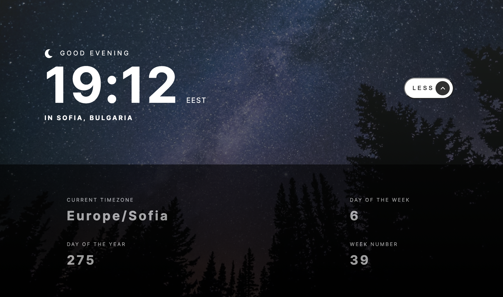

4. Clock App

- [see project](https://sweta-fm-clock-app.netlify.app)
- Using external APIs to set the data based on the visitor's location and generate random programming quotes. User can:

  - View the current time and location information based on their IP address
  - View additional information about the date and time in the expanded state (sidebar)
  - Be shown the correct greeting and background image based on the time of day they're visiting the site
  - Generate random programming quotes by clicking the refresh icon near the quote

- Using the following APIs to retrieve the necessary data:

  - https://geolocation-db.com/ to get user IP, city and country
  - http://worldtimeapi.org/ to set the time based on the visitor's IP adress as well as additional data shown in the expanded state.
  - https://api.quotable.io/random to get a random quote

  

    
  

   
  

      
  

   
  

      
  

   
  

      
  

   
