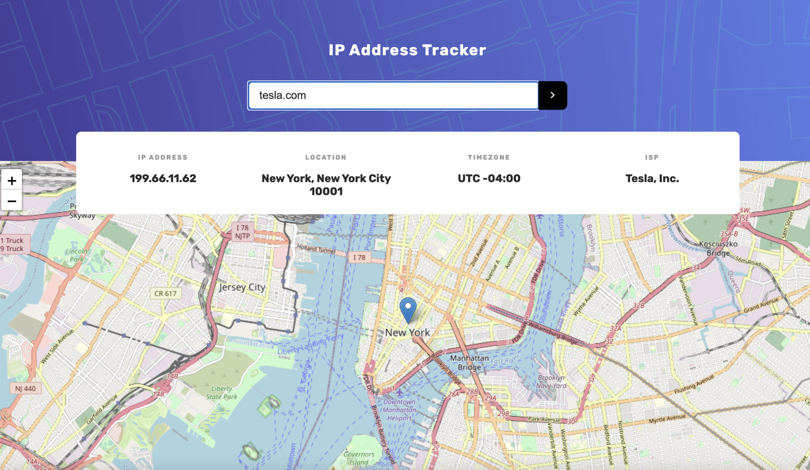

## Frontend Mentor Challenges / using CSS and React JS

1. URL shortening API landing page / using CSS, React JS and API

- [See project] (https://sweta-fm-url-shortening.netlify.app)
- Navbar with toggle sidebar; sidebar height set dynamically depending on number of links
- Hero and statistic section
- Form - Link Shortener. You can make links shorter and easier to remember. Just enter a Link into the form and click on the Button to generate a short Link. When visiting the short-Link, the short-Link will immediately redirect you to the long Link.
  - Using API: https://shrtco.de/docs/
  - Copy the shortened link to user's clipboard in a single click. Receive an error message when the form is submitted with empty input field or incorrect url.
  - User can see a list of their shortened links, even after refreshing the browser (local storage)
  - Form error message and 'Copied' class for copy-btn are temporary. Using setTimeout.

    

 

    

 

    

 

    

 

    

 

2. Todo App

- [see project](https://sweta-todo-app.netlify.app)
- Add new todos to the list
- Mark todos as complete
- Delete todos from the list
- Filter by all/active/complete todos
- Clear all completed todos
- Toggle light and dark mode

3. IP Address Tracker

- [see project](https://sweta-fm-ip-tracker.netlify.app)
- To get the IP Address locations, we'll be using the IP Geolocation API by IPify (https://geo.ipify.org). To generate the map, we are using LeafletJS (https://leafletjs.com).
- Users see their own IP Address on the map on the initial page load. They can search for any IP addresses or domains and see the key information and location.
- working with .env
- what helped me:
  - [React-Leaflet demo](https://www.youtube.com/watch?v=290VgjkLong)
  - map showing bug: https://stackoverflow.com/questions/67552020/how-to-fix-error-failed-to-compile-node-modules-react-leaflet-core-esm-pat

    

 

    

 

4. Clock App

- [see project]()
- Using external APIs to set the data based on the visitor's location and generate random programming quotes. User can:

  - View the current time and location information based on their IP address
  - View additional information about the date and time in the expanded state (sidebar)
  - Be shown the correct greeting and background image based on the time of day they're visiting the site
  - Generate random programming quotes by clicking the refresh icon near the quote

- Using the following APIs to retrieve the necessary data:

  - https://geolocation-db.com/ to get user IP, city and country
  - http://worldtimeapi.org/ to set the time based on the visitor's IP adress as well as additional data shown in the expanded state.
  - https://api.quotable.io/random to get a random quote

    

      
  

   
  

      
  

   

#### For deployment on Netlify:

- copy/paste the project in a new folder and run in the terminal: npm run build. Drag and drop the build folder on Netlify. To update the project: open it on Netlify => Deploy button (up left), drag and drop build folder from the project from my desktop.

- In the public folder => create \_redirects file => with the following content: /\* /index.html 200
  In the package.json => "build": "CI= react-scripts build"
  If we have .env file => on Netlify => in Build & deploy => Environment variables => copy/paste the name and the value
